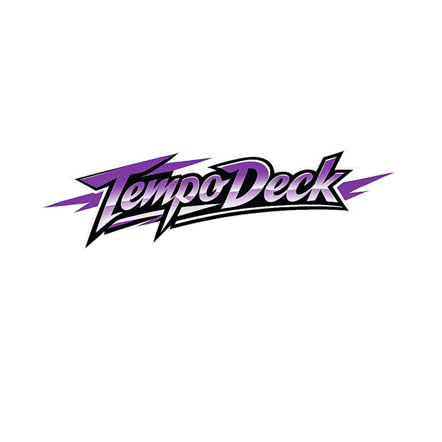

# TempoDeck

A professional metronome for iOS, Android, macOS, and Windows — built in
Flutter with a sample-accurate audio engine, songs, setlists, and a live
performance mode.

<p align="center">
  
</p>

<p align="center">
  ☕ Enjoying TempoDeck or its code? Feel free to <a href="https://ko-fi.com/s3gvdev">buy me a coffee on Ko-fi</a> — no perks, no strings, just a small thank-you.
</p>

## Why this exists

TempoDeck started as a paid app for practicing musicians. When the commercial
side wound down, the codebase was too interesting to let disappear — it's a
real Flutter product, with the messy platform-specific corners a marketing
site doesn't show. This repository is the app in its final form, with the
licensing, IAP and update-checker machinery stripped out. Everything you
would need to ship a similar app is here; the shipping-it part is your call.

## Features

- **Metronome** with tempo, subdivision, accent pattern editor and interval
  training (BPM increments, bounded duration)
- **Song editor** — beatmaps, events, alternative endings, transitions,
  linked backing tracks
- **Setlists** with per-song overrides and transition steps
- **Live mode** with a distraction-free view, gapless transitions and
  external audio-interruption handling
- **Presets** save any metronome configuration for one-tap recall
- **Backups** — full JSON export/import of songs, setlists and presets
- **Desktop audio device picker** on macOS/Windows

## Architecture highlights

- **~42k lines of production Dart** across 153 files, backed by **~23k lines
  of tests** across 86 test files (unit + widget)
- **Riverpod** for state, with pure `Notifier`/`Provider` — no
  `ChangeNotifier`, no `StateProvider`
- **Interface-based platform abstraction** — every side-effectful boundary
  (audio engine, file storage, export client, audio device service) is behind
  an interface, wired per-platform in
  [`lib/core/providers/service_providers.dart`](lib/core/providers/service_providers.dart)
- **Pure domain layer** in [`lib/core/domain/`](lib/core/domain/) — no
  Flutter, no annotations, no I/O
- **Feature isolation** — features import repositories, never DAOs; feature
  code never imports `lib/platform/`
- **`AppVariant`** enum drives mobile vs. desktop wiring without inline
  `Platform.isX` checks in feature code
- **Custom widget library** in [`lib/core/widgets/`](lib/core/widgets/) —
  buttons, sliders, cards, dropdowns, section headers, splash screen, all
  built on a shared theme
- **Sample-accurate audio** via [SoLoud](https://pub.dev/packages/flutter_soloud)
  on desktop, with FFmpeg-backed export on both mobile and desktop

## Tech stack

| Layer | Choice |
| ----- | ------ |
| Framework | Flutter 3.41 (stable) |
| State | Riverpod 2 |
| Routing | go_router |
| Persistence | Drift (SQLite) + SharedPreferences |
| Audio | flutter_soloud, ffmpeg_kit_audio_flutter |
| Files | file_picker, share_plus, path_provider |
| Testing | flutter_test |

## Project structure

```
lib/
├── core/                    # Framework-agnostic building blocks
│   ├── app/                 # Root widget + splash
│   ├── audio/               # Engine interfaces + implementations
│   ├── backup/              # JSON import/export
│   ├── db/                  # Drift schema and DAOs (repositories only)
│   ├── domain/              # Pure Dart domain models
│   ├── files/               # File pickers, storage, path repair
│   ├── providers/           # Riverpod wiring
│   ├── repositories/        # Repository interfaces
│   ├── router/              # go_router config + routes
│   ├── theme/               # Colors, typography, animations
│   └── widgets/             # Reusable UI primitives (TD*)
├── features/                # Feature modules
│   ├── metronome/
│   ├── songs/
│   ├── setlists/
│   ├── live/
│   ├── settings/
│   └── export/
├── platform/                # Platform-specific shells and dialogs
│   ├── mobile/
│   └── desktop/
├── main.dart                # Dispatches to the right entry point
├── main_mobile.dart         # Mobile entry point
└── main_desktop.dart        # Desktop entry point
```

## Build guide

TempoDeck targets four platforms. You only need the toolchain for whichever
one you want to build.

### 1. Common prerequisites

- [Flutter SDK 3.41.x](https://docs.flutter.dev/get-started/install), stable
  channel — `flutter --version` should report 3.41 or newer 3.41 patch
- Git

Run once after cloning:

```bash
flutter pub get
flutter doctor
```

`flutter doctor` will tell you what platform toolchains are missing. Install
the ones you need for your target(s).

### 2. iOS

Requirements:
- macOS with Xcode 15+
- CocoaPods (`sudo gem install cocoapods` or via Homebrew)
- An Apple Developer account for device deployment

Debug on a simulator or attached device:

```bash
flutter run -d ios
```

Release build (unsigned) for CI:

```bash
flutter build ios --release --no-codesign
```

For a signed IPA, open `ios/Runner.xcworkspace` in Xcode, set the
**Development Team** under _Signing & Capabilities_, then:

```bash
flutter build ipa --release
```

### 3. Android

Requirements:
- Android Studio + SDK (minimum API 24)
- JDK 17

Debug:

```bash
flutter run -d android
```

Release AAB for the Play Store:

```bash
flutter build appbundle --release
```

For release signing, drop a `key.properties` file next to
`android/app/build.gradle.kts` with the following keys and Gradle will pick
it up automatically. Without it, release builds fall back to the debug
signing config.

```properties
storeFile=/absolute/path/to/keystore.jks
storePassword=…
keyAlias=…
keyPassword=…
```

### 4. macOS (Desktop)

Requirements:
- macOS with Xcode 15+
- CocoaPods

Debug:

```bash
flutter run -d macos
```

Release build:

```bash
flutter build macos --release
# Output: build/macos/Build/Products/Release/tempodeck.app
```

For code signing, open `macos/Runner.xcworkspace` in Xcode and set your
**Development Team** under _Signing & Capabilities_ (macOS target). The
build otherwise runs sandboxed against the local certificate. Notarization
for distribution outside the App Store is a manual `notarytool` step and
not covered here.

> **The macOS build is a local-only build, by design.** It is not part of CI.
> `ffmpeg_kit_audio_flutter` declares macOS in its plugin platforms but the
> published package ships no `macos/` directory, so `pod install` finds no
> podspec on a clean checkout and CI cannot build the app. Audio export on
> desktop doesn't use that plugin anyway — it shells out to the `ffmpeg`
> binary installed on the machine.

### 5. Windows (Desktop)

Requirements:
- Windows 10/11
- Visual Studio 2022 with the **Desktop development with C++** workload

Debug:

```bash
flutter run -d windows
```

Release build:

```bash
flutter build windows --release
# Output: build\windows\x64\runner\Release\tempodeck.exe
```

The `.exe` needs the DLLs next to it (in the same `Release/` folder) to
run — copy the entire folder when distributing.

## Testing

```bash
flutter analyze          # zero warnings expected
flutter test             # ~630 tests, mostly unit + widget
```

CI runs both on every push and pull request, on a macOS runner — parts of the
suite exercise the real audio engine, and `flutter_soloud` ships no prebuilt
library for Linux.

## Contributing

Issues and pull requests are welcome. Please keep changes focused, add tests
for logic changes, and match the existing code style (`flutter analyze` must
stay clean).

## License

[MIT](LICENSE). Third-party assets and their licenses are listed in
[CREDITS.md](CREDITS.md).
